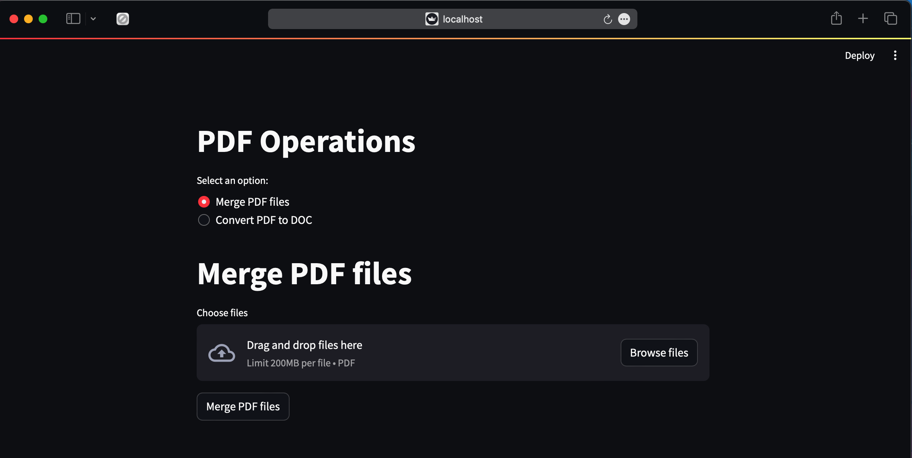

# PDF Operations
 Performs various PDF operations such as merging PDF, PDF to DOCX and vice versa with a web UI.



## Project Highlights
- Upload the PDF files you want to merge or convert 
- Once, they are converted, you can download it back by clicking the download button

## Python Libraries Used
The set of python libraries used include the following
- PyPDF2(for merging the PDF)
- pdf2docx(for converting PDF to DOCX)
- docx2pdf(for converting DOCX to PDF)(in progress)
- tempfile(to store the uploaded files into a temporary directories)
- streamlit(for UI)

## Installation
1.Clone this repository to your local machine using:

```bash
  git clone https://github.com/OmSDeshmukh/Pdf-Operations
```
2.Navigate to the project directory:

```bash
  cd Pdf-Operations
```

3. Create a virtual environment:

```bash
python3 -m venv venv
```

4. Activate the virtual environment:

```bash
# On Windows
venv\Scripts\activate

# On macOS/Linux
source venv/bin/activate
```

5. Install the required dependencies using pip:

```bash
  pip install -r requirements.txt
```

## Usage

1. Run the main.py file in the src folder
```bash
cd Pdf-Operations
streamlit run main.py
```

## Project Structure

- main.py: Contains all the UI code for running all the processes
- pdf_merger.py: Contains code to merge pdfs
- pdf_to_doc.py: To convert pdf file into docx
- doc_to_pdf: To convert docx to pdf file
- files: To store the merged and converted files
